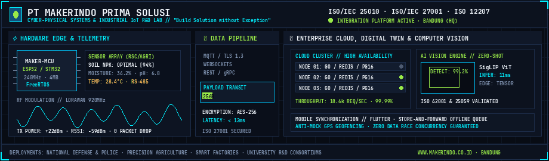
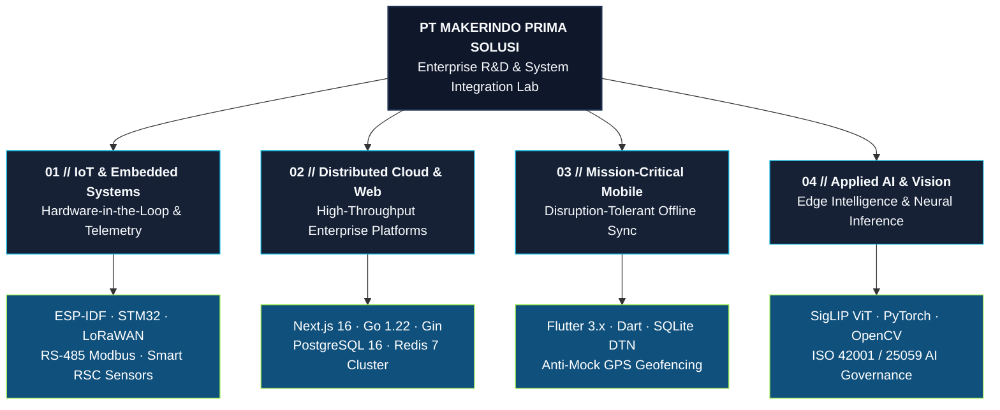

<div align="center">


<br/><br/>

# 🏢 PT Makerindo Prima Solusi
### **Build Solution without Exception**

**Enterprise IT Consultancy · Internet of Things (IoT) · Industrial Embedded Systems · AI & Software R&D**

📍 Bandung, West Java, Indonesia • 🌐 [makerindo.co.id](https://makerindo.co.id/) • 📧 [makerdotindo@gmail.com](mailto:makerdotindo@gmail.com)

[](https://makerindo.co.id/)
[](#-standards--quality-governance)
[](https://github.com/makerindo-repository/.github/blob/main/SECURITY.md)
[](#-standards--quality-governance)
[](https://maps.google.com/?q=Makerindo+Prima+Solusi)

</div>

---

## 🏛️ Executive Company Profile

Founded in June 2019 in Bandung, **PT Makerindo Prima Solusi** is an Indonesian institutional technology engineering firm and research laboratory. We specialize in end-to-end hardware-software system integration, industrial IoT, embedded firmware engineering, enterprise distributed web platforms, resilient mobile computing, and applied artificial intelligence.

Our technical solutions empower high-consequence operations across national defense institutions, government bodies, precision agriculture, smart industrial automation, and university research consortiums.

---

## 🔬 Core R&D Divisions & Enterprise Architecture



---

## 🛠️ Technology Competencies & Standards Matrix

| Engineering Division | Production Technology Stack | Architectural Standards & Protocols |
|---|---|---|
| **Industrial IoT & Embedded Systems** |     | FreeRTOS, Modbus RTU/ASCII over RS-485, LoRa Mesh dynamic routing, binary telemetry codecs, sensor calibration |
| **Distributed Cloud & Backend** |     | Clean Architecture, Go concurrency (0 race condition guarantee), WebSockets, Redis Geospatial caching, RBAC |
| **Frontend & Enterprise Web** |     | Next.js 16 (App Router), React 19, Turbopack, GIS Map Visualization (Leaflet), WCAG AA contrast standards |
| **Mission-Critical Mobile** |    | Flutter BLoC pattern, offline transactional Store-and-Forward queue, disruption-tolerant synchronization |
| **Applied AI & Computer Vision** |    | Google SigLIP ViT, Zero-Shot Visual Classification, real-time edge inference pipelines, ISO 42001 verification |
| **DevOps, Security & QA** |    | Multi-stage container builds, automated CI quality gates, static analysis, cryptographic commit signing |

---

## 🌐 Impact Sectors & Client Deployments

```
+-----------------------------------------------------------------------------------------+
|                                    DEPLOYMENT SECTORS                                   |
+----------------------------+----------------------------+-------------------------------+
|  DEFENSE & LAW ENFORCEMENT |  AGRICULTURE & ENVIRONMENT |  INDUSTRY & HIGHER EDUCATION  |
|  - Tactical Telemetry Mesh |  - Rapid Soil Checker (RSC)|  - Smart Industrial Automation|
|  - Anti-Mock GPS Geofencing|  - Precision Farming Telemetry- University Consortium R&D  |
|  - Cadet Evaluation Systems|  - Environmental Sensors   |  - National Tech Bootcamps    |
+----------------------------+----------------------------+-------------------------------+
```

---

## 🛡️ Standards & Quality Governance

All engineering artifacts and software assets produced by **PT Makerindo Prima Solusi** comply with international quality frameworks:
- **ISO/IEC 25010:2023 (Systems and Software Quality Requirements)**: Strict performance efficiency, zero redundant UI elements, sub-second latency, and fault tolerance.
- **ISO/IEC 27001:2022 (Information Security Management)**: Cryptographic integrity, zero hardcoded secrets, vulnerability disclosure management, and rigorous access control.
- **ISO/IEC 12207:2017 (Systems and Software Engineering Lifecycle)**: Baseline configuration control (`main` branch convention), automated CI regression testing, and modular architecture.
- **ISO/IEC 42001:2023 & ISO/IEC 25059:2023 (Artificial Intelligence Governance)**: Deterministic evaluation and transparency in machine learning models.

---

## 🔐 Vulnerability Disclosure Policy

Security is a primary pillar of our engineering culture. Vulnerabilities discovered in any Makerindo repository or platform should be reported responsibly adhering to our [Security Policy](https://github.com/makerindo-repository/.github/blob/main/SECURITY.md) by contacting **makerdotindo@gmail.com**.

---

## 📬 Corporate Headquarters & Contact

- **Corporate Portal**: [https://makerindo.co.id/](https://makerindo.co.id/)
- **Institutional Email**: [makerdotindo@gmail.com](mailto:makerdotindo@gmail.com)
- **Direct Hotline / WhatsApp**: +62 812-1821-0613
- **Headquarters**: Komplek Pesona Ciganitri Blok A39, Cipagalo, Bojongsoang, Kab. Bandung, Jawa Barat 40287, Indonesia
- **Operational Hours**: Monday – Friday, 08:00 – 17:00 WIB (UTC+7)

<div align="center">

<sub>Copyright © 2019 – 2026 **PT Makerindo Prima Solusi**. All rights reserved.</sub>

</div>
